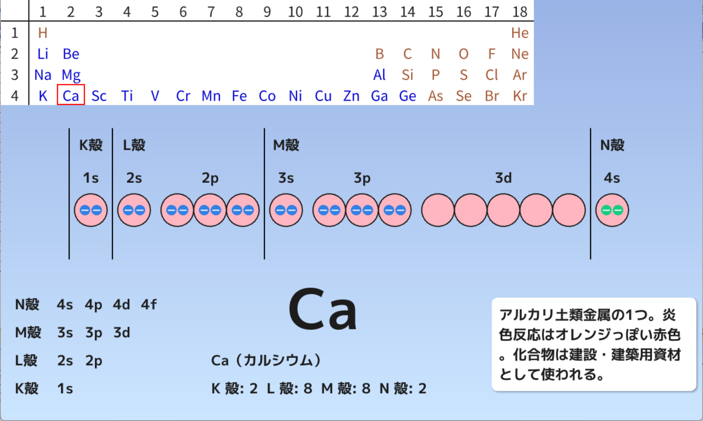

# 化学
## ① 原子の電子配置
高校化学の初めの一歩は、原子番号1～20番までの元素記号を覚えることから始まります。高校で化学の授業があり、**「水兵　リーベ　ぼくの船　七曲り　シップス　クラークか」**という伝統的な語呂合わせ（← 地方によって若干の違いあり）を知らない人はいないでしょう。語呂合わせを口ずさみながら、まずは元素記号と元素名が一致するようにしましょう。

元素記号と元素名を覚えた後は、次に各原子の**最外殻電子**の数を答えられるようになりましょう。最外殻電子は、原子どうしが結びつく際、つまり**化学結合の際、重要な役割を果たします。**元素記号と元素名が一致し、各原子の最外殻電子の数をパッと答えられるようになれば、とりあえず高校化学への入門はばっちりです。

[原子の電子配置を描く :fontawesome-brands-windows:](https://okiraku-lab.github.io/electronic_configuration/electronic_configuration.html){:target="_blank" .md-button }

<!--
???noteとすることで、クリックで開くノートになる
-->
!!!note "アプリの使い方"
	- 周期表上の元素記号をクリックすれば、その原子の電子配置が描かれます
	- 非金属元素の場合、画面の左下に電子式が描かれます。画面をクリックすれば、電子式が構造式に切り替わります
	- 金属元素の場合、最外殻電子（緑色）をクリックすれば、イオンの状態になります
<!--
<iframe width="560" height="315" src="https://www.youtube-nocookie.com/embed/QPy3fnZPiH0?si=GZJuOmYR6YBS7521" title="YouTube video player" frameborder="0" allow="accelerometer; autoplay; clipboard-write; encrypted-media; gyroscope; picture-in-picture; web-share" referrerpolicy="strict-origin-when-cross-origin" allowfullscreen></iframe>
-->
| 電子は波でもあり、粒でもある | 電子配置と周期表の関係性 |
| :---: | :---: |
| <iframe src="https://www.youtube-nocookie.com/embed/QPy3fnZPiH0?si=GZJuOmYR6YBS7521" title="YouTube video player" frameborder="0" allow="accelerometer; autoplay; clipboard-write; encrypted-media; gyroscope; picture-in-picture; web-share" referrerpolicy="strict-origin-when-cross-origin" allowfullscreen></iframe> | <iframe src="https://www.youtube-nocookie.com/embed/MvrVoqUzy30?si=Q4Ir6MmZYD2TO-8C" title="YouTube video player" frameborder="0" allow="accelerometer; autoplay; clipboard-write; encrypted-media; gyroscope; picture-in-picture; web-share" referrerpolicy="strict-origin-when-cross-origin" allowfullscreen></iframe> |

## ② 原子軌道
原子軌道の考え方は、高校化学では発展的な内容になっていますが、この考え方を知れば、**「なぜ、カルシウム（Ca）では最後の2個の電子がM殻ではなくN殻に収まるのか」** や **「なぜ、元素の周期表は凸凹した形になっているのか」**など、ちょっとした疑問が解決します。

K殻、L殻、M殻などの電子殻は、s、p、d、…と呼ばれる軌道からできています。K殻はs軌道しか持たず、**1s軌道**と呼びます。L殻にはs軌道とp軌道が存在し、**2s軌道**、**2p軌道**と呼びます。M殻にはs軌道、p軌道、d軌道があり、それぞれ**3s軌道**、**3p軌道**、**3d軌道**と呼びます。原子が安定な電子配置を取るとき、電子は各軌道に次のような順番で収まることがわかっています。

**1s(2) → 2s(2) → 2p(6) → 3s(2) → 3p(6) → 4s(2) → 3d(10) → 4p(6) …**

カルシウム（Ca）では、M殻の3d軌道よりも先にN殻の4s軌道に電子が収まるため、k(2) L(8) M(8) N(2)という電子配置になります。

化学の学習の際、ふと高度な疑問を抱くと、すぐ原子軌道の考え方にぶつかります。そのような場合に備えて、原子軌道の知識は持っておいて損はないでしょう。

[原子軌道を描く :fontawesome-brands-windows:](https://okiraku-lab.github.io/atomic_orbital/atomic_orbital.html){:target="_blank" .md-button }

!!!note "アプリの使い方"
	- 周期表上の元素記号をクリックすれば、その原子の電子配置が描かれます
	- 金属元素の場合、最外殻電子（緑色）をクリックすれば、イオンの状態になります
| 原子軌道の考え方 | 原子軌道と周期表の関係性 |
| :---: | :---: |
| <iframe src="https://www.youtube-nocookie.com/embed/cpylLQsnfWw?si=J-HWJwmeQLLhBX8Z" title="YouTube video player" frameborder="0" allow="accelerometer; autoplay; clipboard-write; encrypted-media; gyroscope; picture-in-picture; web-share" referrerpolicy="strict-origin-when-cross-origin" allowfullscreen></iframe> | <iframe src="https://www.youtube-nocookie.com/embed/FBaGaEwG3wk?si=n2nKAN8WBoAwFB_9" title="YouTube video player" frameborder="0" allow="accelerometer; autoplay; clipboard-write; encrypted-media; gyroscope; picture-in-picture; web-share" referrerpolicy="strict-origin-when-cross-origin" allowfullscreen></iframe> |

原子軌道の考え方は、さまざまな場面で役立ちます。たとえば、**クロム（Cr）や銅（Cu）の最外殻電子が1つとなる理由** や **鉄（Fe）や銅（Cu）には2種類のイオンがある理由**、**鉄が磁性をもつ理由**など、遷移元素の不思議な特徴を理解するためには、原子軌道の考え方が不可欠です。

1. **クロム（Cr）や銅（Cu）の最外殻電子が1つとなる理由**

    クロムの場合、原子軌道の原則どおりに電子を配置すると、5つの3d軌道のうち、1つだけ電子が存在しない状態になります。そのアンバランスな状態を解消するため、4s軌道の電子が3d軌道に1つ移動し、最外殻電子は4s軌道にある電子1つとなります。
    <video width="100%" autoplay loop muted controls>
			<source src="/assets/クロムの場合.mp4" type="video/mp4">
            動画を再生できません。
	</video>

    銅の場合も、話はほとんどクロムと同じです。原子軌道の原則どおりに電子を配置すると、5つの3d軌道のうち、1つの軌道だけ、電子が1つ存在することになります。そのアンバランスな状態を解消するため、4s軌道の電子が3d軌道に1つ移動し、すべての3d軌道に電子が2つ収まり、結果的に最外殻電子は4s軌道にある電子1つとなります。**銅の最外殻電子が1個となることは、周期表の11族にCuが属することと関係しています**。
    <video width="100%" autoplay loop muted controls>
			<source src="/assets/銅の場合.mp4" type="video/mp4">
            動画を再生できません。
	</video>

2. **銅（Cu）などに2種類のイオンがある理由**
    
    現在執筆中