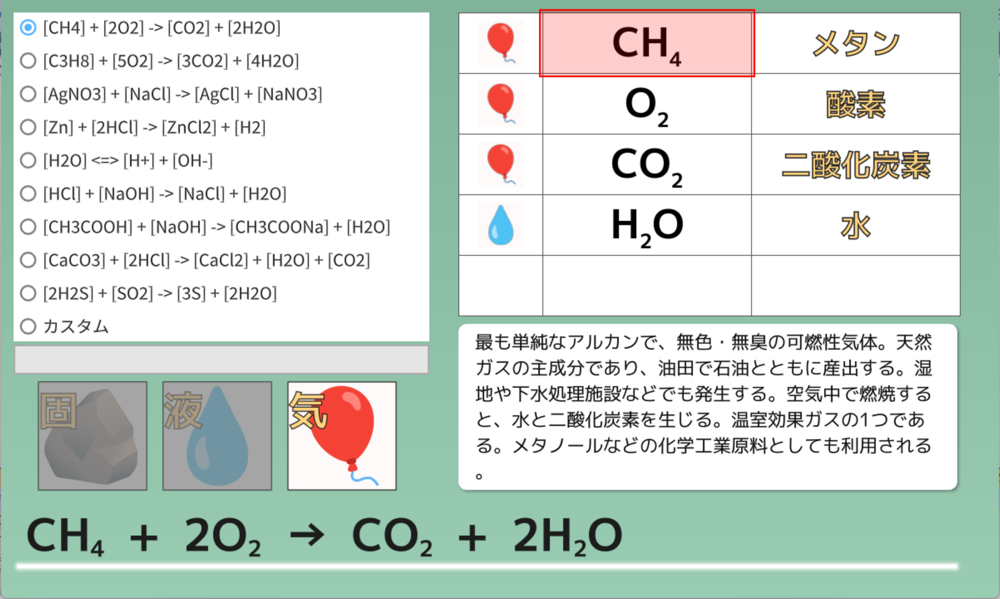

# 化学
## ① 化学反応式
**化学反応式**とは、物質の化学式を使って、**化学変化**を表した式です。物質は一つひとつが単独で存在しているわけではなく、物質と物質が衝突すれば、そのエネルギーによって、物質を構成する原子の組み合わせが変わることがあります。化学反応式のつくり方を理解することは、さまざまな点で重要です。

- **反応の前後で原子の種類や数は変化しない**
		
	化学変化では、反応の前後で原子の種類や数は変化しません。これは、**質量保存の法則**を表しています。たとえば、「2H₂ + O₂ → 2H₂O」という反応を見ると、反応の前後で水素原子と酸素原子の数は変化していないことがわかります。これは、粒子の過不足のない対応関係を示しています。

- **物質量の比の理解**

	化学反応式は、単なる定性的な変化（何が反応し、何が生じるか）を示すだけではなく、**「どれだけの量が反応するか」**…を示しています。
	
	たとえば、メタンが燃焼する反応「CH₄ + 2O₂ → CO₂ + 2H₂O」を考えましょう。反応式の係数は、反応する物質の物質量（モル）の比を示します。化学反応式の係数から、メタン1molが燃焼するとき、酸素2molが必要であり、二酸化炭素1molが生成することがわかります。このモル比がわからなければ、反応物や生成物の質量、気体の体積などを求めることができません。

- **化学変化のルール**

	化学変化（原子の組み換え）は無秩序に起こるわけではなく、特定のルール（上記のメタンの例の場合、**燃焼（酸化）**）に従って起こります。このルールには、燃焼、中和、酸化還元、遊離、分解などの種類があります。

[化学反応式 :fontawesome-brands-windows:](https://okiraku-lab.github.io/chemical_equation/chemical_equation.html){:target="_blank" .md-button }

!!!note "アプリの使い方"
	- ラジオボタンから文字列を1つ選択すれば、画面の下側に化学反応式が大きく描かれ、式中に登場する物質がリストアップされます
	- 物質の化学式をクリックすれば、その物質の説明が表示されます
    - カスタムを選択すれば、テキストボックスに任意の文字列を入力することができます。文字列が規則に従っていれば、化学反応式が描かれ、物質が検出されます

!!!warning "アプリの今後の展開"
	- 化学反応式の種類も物質の説明もまだまだ数が少なく、実用性に乏しいため、今後アプリを大幅に拡張する予定です
	- 反応が起こるルールについても、アプリ内で追記を行います