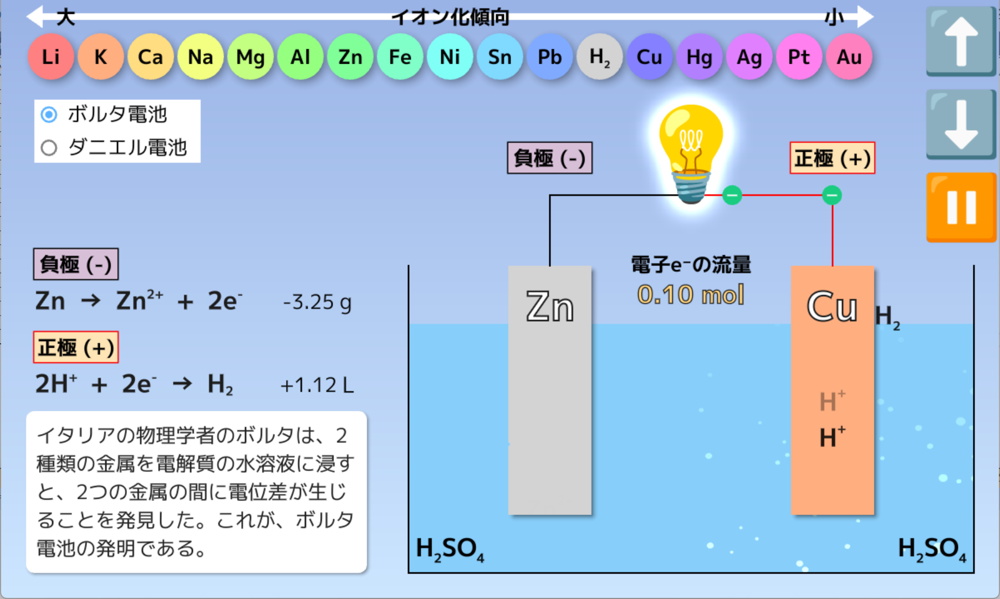

# 化学
## ① 酸化数
現在執筆中

## ② 酸化数の計算
酸化数の計算のしかたを練習するためのWebアプリです。

[酸化数の計算 :fontawesome-brands-windows:](https://okiraku-lab.github.io/oxidation_number/oxidation_number.html){:target="_blank" .md-button }

!!!note "アプリの使い方"
	- 画面の左上の表は、7つの原子（H、N、O、S、Cl、Cr、Mn）について、酸化数の変化とそれに対応する化合物（イオン）をまとめたものです。
	- 表中の化学式をクリックすれば、その物質の化学式が表示され、同時に各原子の酸化数が表示されます
    - 🔁マークを押せば、ゲームモードに切り替わります。右上のパットで、下線が引かれた原子の酸化数を入力し、🔛マークを押せば、正誤が判定されます

- **最高酸化数と最低酸化数**
		
	現在執筆中

## ③ 化学電池
酸化還元反応を利用し、化学エネルギーを電気エネルギーとして取り出す装置を、**電池（化学電池）**といいます。

[化学電池 :fontawesome-brands-windows:](https://okiraku-lab.github.io/chemical_cell/chemical_cell.html){:target="_blank" .md-button }

!!!note "アプリの使い方"
	- 画面をクリックすれば、電池の放電が始まり、電球💡が光ります。
	- ボタンをクリックすれば、電極を引き上げたりもとに戻したりすることができます。電極が水溶液から離れると、電池の放電が止まります
    - 左側のラジオボタンで、ボルタ電池とダニエル電池を切り替えることができます

## ④ 電気分解
電気エネルギーによって強制的に酸化還元反応を起こすことを、**電気分解**といいます。

[電気分解 :fontawesome-brands-windows:](https://okiraku-lab.github.io/electrolysis/electrolysis.html){:target="_blank" .md-button }

!!!note "アプリの使い方"
	- 画面をクリックすれば、電気分解🔋が始まります
	- ボタンをクリックすれば、電極を引き上げたりもとに戻したりすることができます。電極が水溶液から離れると、電気分解が止まります
    - 3種類のプルダウンは、陽極の種類、陰極の種類、電解質の種類に対応しています。電極や電解質の種類を変えれば、別の化学変化が起こります